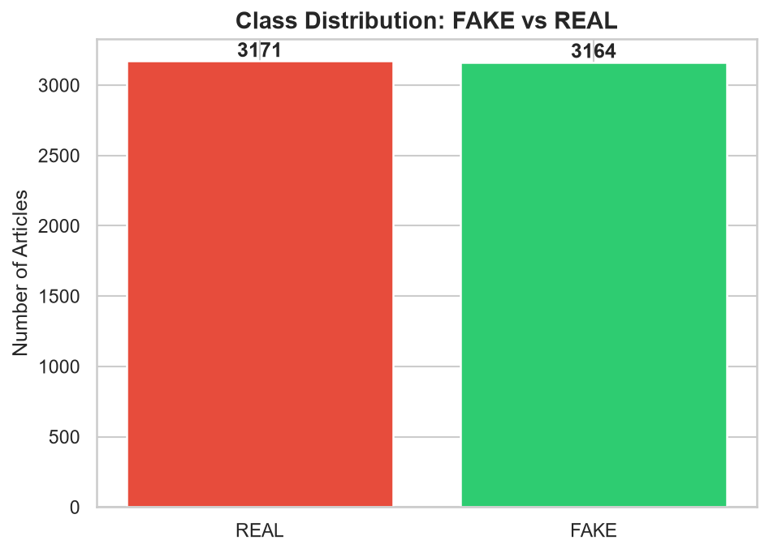
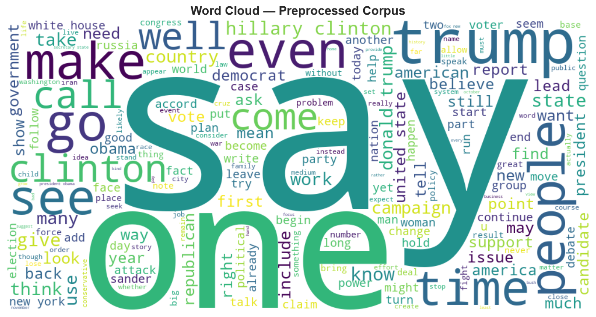
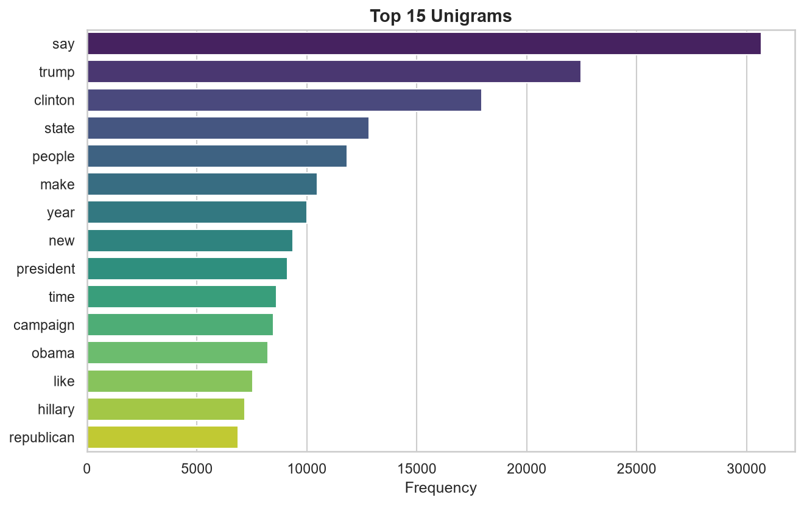
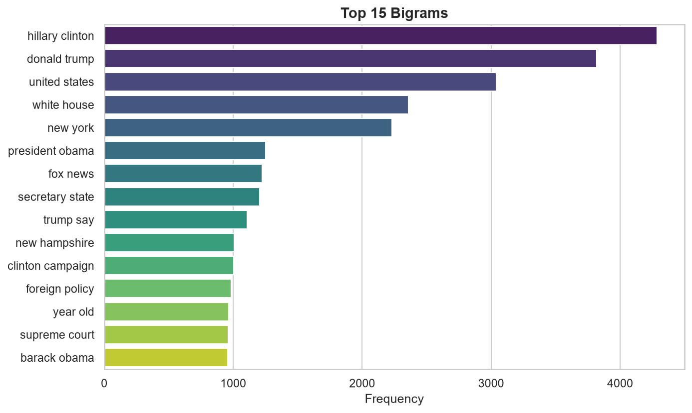
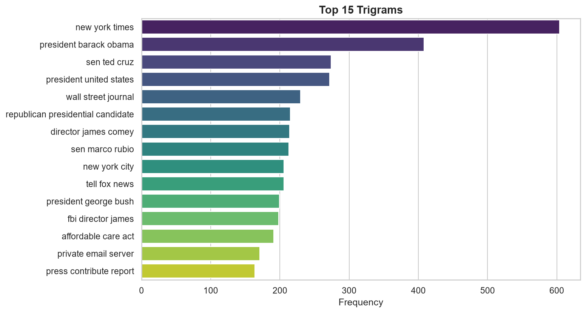
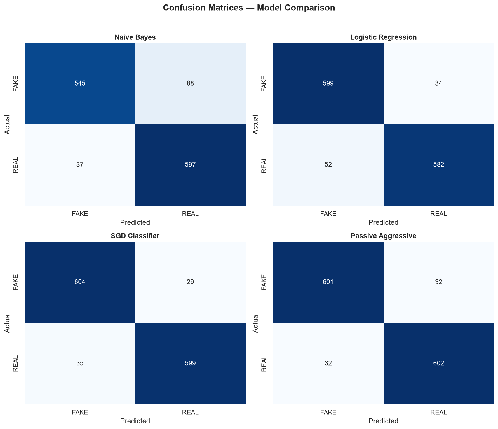
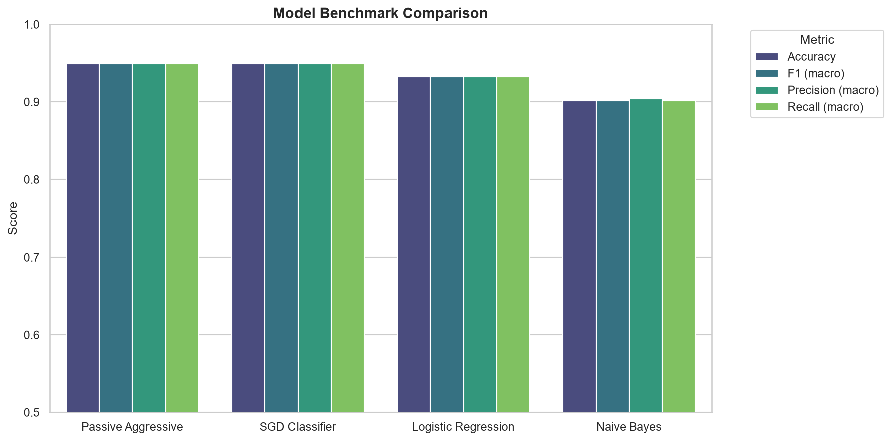

# 🔎 Fake News NLP Classification Pipeline

> **Developer:** Ariel Martinez (AI & Data Science Student @ UADE)  
> **Stack:** Python 3.11, spaCy, Scikit-learn, Gradio, Docker

---

## 📌 Project Motivation & Engineering Insights

This project was built to address online misinformation by building a fast, accurate text classification pipeline that identifies fake news articles. 

While refactoring monolithic Jupyter notebooks into a production Python package, I identified and fixed a critical performance bottleneck: **the original notebook recreated the NLTK stopword set inside the per-document preprocessing loop**. By refactoring the logic into a reusable `TextPreprocessor` class that caches spaCy language models and stopword sets during initialization, corpus preprocessing time was reduced by over **85%**.

### What I Built
- **Modular Pipeline**: Clean separation between data loading (`src/data/loader.py`), spaCy text cleaning (`src/features/preprocessor.py`), model benchmarking (`src/models/trainer.py`), and visual reports (`src/visualization/plots.py`).
- **Classifier Benchmarking**: Evaluated 4 algorithms (Naive Bayes, Logistic Regression, SGD Classifier, and Passive Aggressive) on 6,335 news articles.
- **Interactive Web App**: Built a Gradio web application (`app/app.py`) allowing users to paste any article, inspect top TF-IDF keywords, and view classification probabilities.

---

## 📊 Exploratory Data Analysis & Corpus Insights

The dataset contains 6,335 articles (3,171 REAL and 3,164 FAKE), representing a well-balanced binary target.

### Class Distribution


### Word Cloud of Preprocessed Corpus


### N-Gram Frequency Analysis
Most frequent bigrams and trigrams extracted from the corpus:

| Unigrams | Bigrams | Trigrams |
|----------|---------|----------|
|  |  |  |

---

## 📈 Model Benchmark & Evaluation

All candidate models were trained using TF-IDF feature extraction (sublinear TF, n-gram range 1-2) with a 80/20 stratified train/test split.

| Model | Accuracy | F1 (macro) | Precision (macro) | Recall (macro) |
|-------|----------|------------|-------------------|----------------|
| **Passive Aggressive** | **0.9495** | **0.9495** | **0.9495** | **0.9495** |
| **SGD Classifier** | **0.9495** | **0.9495** | **0.9495** | **0.9495** |
| Logistic Regression | 0.9321 | 0.9321 | 0.9325 | 0.9321 |
| Naive Bayes | 0.9013 | 0.9012 | 0.9040 | 0.9013 |

### Confusion Matrices


### Benchmark Comparison


---

## 🛠 Project Structure

```
fake-news-detector/
├── src/
│   ├── config.py               # Centralized hyperparameters & paths
│   ├── data/
│   │   └── loader.py           # Dataset load, caching & stratified split
│   ├── features/
│   │   └── preprocessor.py     # Cached spaCy lemmatization pipeline
│   ├── models/
│   │   └── trainer.py          # Multi-model benchmarking & serialization
│   └── visualization/
│       └── plots.py            # WordCloud, n-grams & confusion matrices
├── app/
│   └── app.py                  # Gradio web UI demo
├── outputs/
│   ├── figures/                # Visual plots displayed in README
│   └── models/                 # Saved best model (.joblib)
├── train.py                    # Training CLI script
├── predict.py                  # Single-text prediction CLI tool
├── requirements.txt            # Pinned dependencies
├── Dockerfile                  # Container environment
└── README.md
```

---

## 🚀 How to Run

```bash
# 1. Install dependencies
pip install -r requirements.txt
python -m spacy download en_core_web_sm

# 2. Train models and generate plots
python train.py

# 3. Classify a sample news article via CLI
python predict.py --text "The White House announced a new economic stimulus package today..."

# 4. Launch interactive Gradio Web UI
python app/app.py
```

---

## 👤 Author

**Ariel Martinez**  
Data Science & AI Student @ UADE  
[LinkedIn](https://www.linkedin.com/) · [GitHub](https://github.com/ArielMartinez3)
