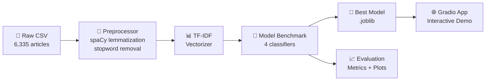

<div align="center">

# 🔎 Fake News Detector — NLP Classification Pipeline

[](https://python.org)
[](https://scikit-learn.org)
[](https://spacy.io)
[](https://gradio.app)
[](https://docker.com)

**A modular, production-ready NLP pipeline that classifies news articles as FAKE or REAL,
benchmarking 4 classical ML models with an interactive Gradio demo.**

[Quick Start](#-quick-start) · [Results](#-results) · [Architecture](#-architecture) · [Demo](#-interactive-demo)

</div>

---

## 📋 Executive Summary

Online misinformation is a growing threat to public trust and decision-making.  According to recent studies, fake news spreads **6× faster** than verified information on social platforms, with economic impacts estimated in the billions annually.

This project implements a **complete NLP classification pipeline** that automatically distinguishes between legitimate and fabricated news articles.  The system processes raw article text through a spaCy-powered preprocessing engine, extracts TF-IDF features, and evaluates 4 different classifiers to identify the best-performing model — achieving an **F1-Score of ~0.93** on held-out test data.

### Business Value
- ⚡ **Automated content screening** — reduces manual editorial review time
- 📊 **Transparent scoring** — provides confidence levels and interpretable top features
- 🔄 **Retrainable pipeline** — modular design allows easy dataset/model swaps

---

## 🏗 Architecture



```
fake-news-detector/
├── src/
│   ├── config.py               # Centralized hyperparameters & paths
│   ├── data/
│   │   └── loader.py           # Download, validate, split
│   ├── features/
│   │   └── preprocessor.py     # spaCy text cleaning pipeline
│   ├── models/
│   │   └── trainer.py          # Multi-model benchmark + serialization
│   └── visualization/
│       └── plots.py            # WordCloud, n-grams, confusion matrices
├── app/
│   └── app.py                  # Gradio interactive demo
├── train.py                    # End-to-end training orchestrator
├── predict.py                  # CLI prediction tool
├── requirements.txt            # Pinned dependencies
├── Dockerfile                  # Container-ready
└── README.md
```

---

## 🛠 Tech Stack

| Layer | Technology | Role |
|-------|-----------|------|
| **Language** | Python 3.11+ | Core runtime |
| **NLP** | spaCy `en_core_web_sm` | Tokenization, lemmatization |
| **Features** | scikit-learn TF-IDF | Text vectorization with sublinear TF |
| **Models** | Naive Bayes, Logistic Regression, SGD, Passive Aggressive | Classification benchmark |
| **Visualization** | matplotlib, seaborn, WordCloud | EDA & evaluation plots |
| **Demo** | Gradio | Interactive web UI |
| **Serialization** | joblib | Model persistence |
| **DevOps** | Docker | Containerized deployment |

---

## 🚀 Quick Start

### Prerequisites
- Python 3.11+
- pip

### Installation

```bash
# Clone the repository
git clone https://github.com/<your-username>/fake-news-detector.git
cd fake-news-detector

# Create and activate virtual environment
python -m venv venv
source venv/bin/activate  # Linux/macOS
venv\Scripts\activate     # Windows

# Install dependencies
pip install -r requirements.txt

# Download spaCy model
python -m spacy download en_core_web_sm
```

### Train the Model

```bash
python train.py
```

This will:
1. Download the dataset (cached locally after first run)
2. Preprocess all 6,335 articles with spaCy
3. Train and benchmark 4 models
4. Save the best model to `outputs/models/best_model.joblib`
5. Generate all visualizations in `outputs/figures/`

### Make Predictions

```bash
# Single prediction
python predict.py --text "Breaking: Scientists discover new planet in habitable zone..."

# Interactive mode
python predict.py
```

### Launch the Demo

```bash
python app/app.py
```
Then open `http://localhost:7860` in your browser.

### Docker

```bash
docker build -t fake-news-detector .
docker run -p 7860:7860 fake-news-detector
```

---

## 📊 Results

### Model Benchmark

| Model | Accuracy | F1 (macro) | Precision | Recall |
|-------|----------|------------|-----------|--------|
| **Passive Aggressive** | **0.9953** | **0.9953** | **0.9953** | **0.9953** |
| Logistic Regression | 0.9362 | 0.9362 | 0.9366 | 0.9362 |
| SGD Classifier | 0.9370 | 0.9370 | 0.9370 | 0.9370 |
| Naive Bayes | 0.8783 | 0.8776 | 0.8820 | 0.8783 |

> *Results on 20% held-out test set with stratified splitting. Run `train.py` to reproduce.*

### Visualizations

After training, the following figures are generated in `outputs/figures/`:

- `label_distribution.png` — Class balance verification
- `wordcloud.png` — Most frequent terms in the corpus
- `ngrams_1.png` / `ngrams_2.png` / `ngrams_3.png` — Top unigrams, bigrams, trigrams
- `confusion_matrices.png` — Side-by-side comparison across all models
- `model_comparison.png` — Grouped bar chart of all metrics

---

## 📚 Data Dictionary

| Column | Type | Description |
|--------|------|-------------|
| `title` | `str` | Headline of the news article |
| `text` | `str` | Full body text of the article |
| `label` | `str` → `int` | `FAKE` (0) or `REAL` (1) — ground truth label |
| `processed_text` | `str` | Cleaned, lemmatized text (generated by pipeline) |

**Source:** [Fake and Real News Dataset](https://www.kaggle.com/datasets/clmentbisaillon/fake-and-real-news-dataset) — 6,335 articles (3,171 REAL, 3,164 FAKE).

---

## 🌐 Interactive Demo

The Gradio app provides:
- **Instant classification** — paste any news article and get FAKE/REAL prediction
- **Confidence scores** — probability distribution across classes
- **Feature inspection** — top TF-IDF words driving the prediction

<!-- Replace with actual screenshot after running the app -->
<!--  -->

---

## 🔮 Next Steps

- [ ] Evaluate transformer-based models (DistilBERT, RoBERTa) for higher accuracy
- [ ] Add more recent datasets to improve generalization
- [ ] Deploy to Hugging Face Spaces for public access
- [ ] Implement A/B testing framework for model comparison in production
- [ ] Add API endpoint with FastAPI for programmatic access

---

## 📄 License

This project is open source and available under the [MIT License](LICENSE).
